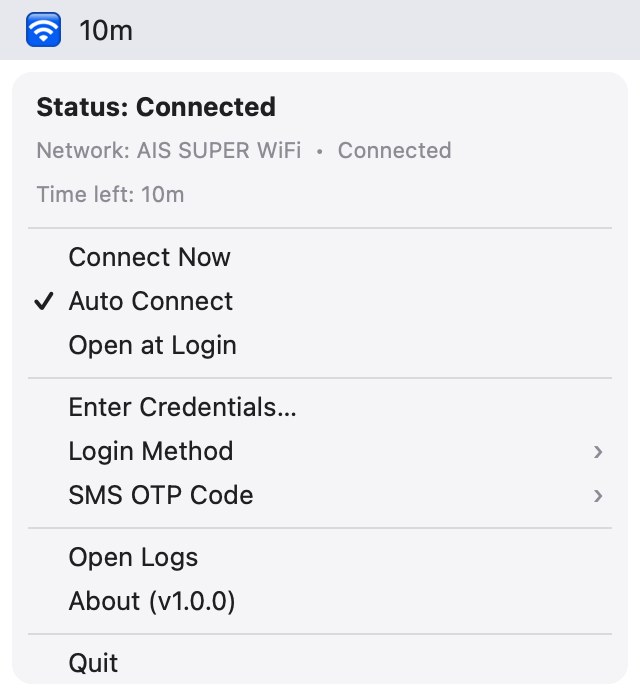
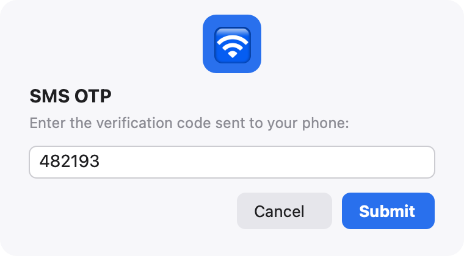

# AIS Wi-Fi Auto-Login 🛜

> 🇹🇭 **Made for Thailand.** This app targets **AIS SUPER WiFi**, the free
> captive-portal Wi-Fi run by the Thai carrier AIS. If you are not in Thailand
> or do not use AIS, it will most likely not be useful to you — though its
> generic captive-portal fallback may work on some other networks.

A small macOS menu bar (tray) app that **automatically logs you back in**
when the connection drops on free captive-portal Wi-Fi networks such as
**AIS SUPER WiFi**.

You're sitting in a café in Thailand, the connection drops every 30 minutes, and each time
you have to enter your phone number + an SMS OTP. This app keeps watching the
connection in the background; as soon as it notices a drop it finds the
portal, logs in with your credentials and verifies that you're online again.
The menu bar icon shows the current state at a glance.

> **Note:** This app automates logging in to a Wi-Fi network you are already
> legally allowed to use, with your own number and credentials. It does not
> bypass any security measure, crack passwords or use anyone else's account.

---

## Screenshots

<p>
  
  &nbsp;&nbsp;
  
</p>

The menu bar dropdown (with the live session countdown) and the SMS OTP prompt
in **Ask me in a window** mode.

---

## What do the icons mean?

| Icon | Status |
|------|--------|
| ⏳ | Checking (at launch / when auto login is turned back on) |
| 🛜 | Online — all good |
| 📴 | No connection (Wi-Fi may be off) |
| 🔒 | Captive portal detected (login required) |
| 🔄 | Logging in… |
| ⚠️ | Error (the second menu line shows the reason) |
| ⏸️ | Auto login is off |

---

## Installation

### 1. Requirements

- macOS
- Python 3.9 or newer (check with `python3 --version`)

### 2. Install the dependencies

Open a Terminal in this folder and run:

```bash
pip3 install -r requirements.txt
```

### 3. Run the diagnostics first (test without the UI)

```bash
python3 run.py --diagnose
```

This command shows the SSID, the Wi-Fi interface, the connection state, the
detected provider, whether credentials are saved, and the SMS OTP from the
last 5 minutes. If something is wrong, this is where you'll see it.

### 4. Install it as a Mac app (recommended)

```bash
python3 make_app.py --open
```

This builds **AIS Wi-Fi Auto-Login.app** into `/Applications` (or
`~/Applications`) and starts it. From then on, start it like any other app —
from Launchpad, Spotlight or the Applications folder; no Terminal needed. The
🛜 icon appears in the menu bar (there is no Dock icon).

The app runs the code with the Python you built it with, so keep that Python
and its installed packages. **Rebuild after updating the code** (quit the app
first). Building needs the Xcode Command Line Tools (`xcode-select --install`).

To try it without installing, you can also run it straight from the Terminal:

```bash
python3 run.py
```

---

## First use

1. From **Enter Credentials…**, enter your phone number (and your password if
   you chose the password method). They are saved to the **macOS Keychain**
   and never kept as plain text in any file.
2. Pick one option from the **Login Method** submenu:
   - **Password (recommended):** fully automatic, single-step login on the AIS
     portal with number + password. No waiting for an SMS. *This is the most
     trouble-free method.* (You can set a Wi-Fi password from the AIS
     app/portal.)
   - **SMS OTP:** the app sends your number to AIS, which texts you a code (this
     code is your account password), and the app reads it from Messages and logs
     in automatically (the permissions below are required). If Messages cannot be
     read, or the code does not arrive in time, it asks you in a small dialog.
     Since every attempt means a new SMS, the OTP method waits at least 60
     seconds between failed attempts. **Tip:** once AIS has texted you a
     password, you can save it under **Enter Credentials…** and switch to the
     Password method for hands-off reconnects with no more SMS.
3. If you use **SMS OTP**, choose where the code comes from in the
   **SMS OTP Code** submenu:
   - **Read code from Messages** — read it automatically from the Mac's
     Messages app (needs Text Message Forwarding + Full Disk Access).
   - **Ask me in a window** — type the code yourself from your phone. Use this
     if forwarding does not reach the Mac, which is common on a captive portal:
     the forwarded SMS travels over the internet, but you have none until you
     are logged in.
4. As long as **Auto Connect** is on, the app handles disconnects on its own.
   You can also trigger it manually at any time with **Connect Now**.

---

## Reading the SMS OTP automatically (optional but recommended)

Only needed if you use the **SMS OTP** method. The app reads the incoming code
from the database of the **Messages** app on your Mac. For that:

### A) iPhone → Mac SMS forwarding
On the iPhone: **Settings → Messages → Text Message Forwarding** → turn on your
Mac. This way the SMS code from AIS also lands in Messages on your Mac.

### B) Full Disk Access
To read the Messages database, the app needs Full Disk Access:
**System Settings → Privacy & Security → Full Disk Access** → **+** → add
**AIS Wi-Fi Auto-Login** from Applications and check it. Then quit and reopen
the app. (If you run `python3 run.py` from a terminal instead, the permission
belongs to that terminal app — Terminal, iTerm, your editor… — so add that one.)

macOS **never shows a permission prompt** for Full Disk Access — apps are not
allowed to ask for it, access is silently denied until you grant it manually.
When you switch to **SMS OTP** without this permission, the app shows a dialog
with an **Open Settings** button that takes you to the right pane.

Rebuilding the app with `make_app.py` gives it a new signature, so macOS may
require you to turn the permission off and on again after a rebuild.

The **Messages : readable / unreadable** line in the output of
`python3 run.py --diagnose` shows whether the permission works.

If you'd rather not grant these permissions, that's fine: with the OTP method
selected, if the app cannot read the code it asks you for it **manually** in a
small dialog. Or skip all of this and use the **Password** method.

---

## SSID reading and Location permission

macOS requires **Location Services** permission to read the name (SSID) of the
Wi-Fi network you're connected to. Without it the app still works; it just
detects "which network am I on" from the portal URL/HTML. To see the SSID:
**System Settings → Privacy & Security → Location Services**.

Note: on macOS 14.4 and later, a Python script that is not packaged as an .app
cannot request Location permission, and `networksetup`/`airport` hide the
network name too; so the SSID will most likely show as "(unreadable)". This is
expected and does not affect logging in.

---

## Starting automatically at login

Turn on **Open at Login** in the app's menu (it is off by default). The app is
then registered as a macOS login item and starts by itself every time you log
in. You can also see and turn it off in **System Settings → General → Login
Items**; if macOS asks for approval there, turn the app on.

This needs the installed Mac app (see step 4) and macOS 13 or later. When
running from the Terminal, the menu item explains how to install the app.

---

## Adding other Wi-Fi hotspots later

The architecture is designed for this. Each network lives as a "provider"
under `aiswifi/providers/`. To add a new network:

1. Use `aiswifi/providers/ais.py` as an example, create a new file
   (e.g. `truewifi.py`) and derive from `BaseProvider`.
2. In `matches()`, describe how to recognise that network (SSID name, portal
   domain or page HTML).
3. Add it to the `build_registry()` list in `aiswifi/providers/__init__.py`
   (`GenericProvider` must always stay last — it is the last resort that uses
   the generic HTML-form login engine for unknown portals).

For most simple captive portals you may not need to write anything at all:
`GenericProvider` finds the form automatically and tries by guessing the
number/password/OTP fields.

---

## Remaining session time (the countdown)

The AIS portal ends your connection when its countdown runs out. The app reads
that same countdown from the portal and shows it while you are online:

- next to the 🛜 icon in the menu bar (e.g. **🛜 9:59**), and
- as **Time left** in the menu.

`python3 run.py --diagnose`, run on the AIS network, prints a **Time left**
line too. When the countdown reaches zero and the connection drops, the app
logs you back in as usual, so a fresh countdown starts. To hide it from the
menu bar, set `"show_time_in_menubar": false` in
`~/.config/aiswifi/config.json`. (Unlimited packages show **Unlimited**.)

---

## Where your credentials are sent

The AIS portal (`wifi.ais.co.th`) is a single-page app that authenticates
through a small JSON API, so the app talks to that API directly rather than
scraping a form. Your AIS credentials are only ever sent to **AIS domains
(`*.ais.co.th`)**, so a fake hotspot that merely names itself "AIS" cannot
collect them. If your AIS hotspot's portal lives on another host (for example
a gateway such as `10.0.0.1`), tell the app to trust it in
`~/.config/aiswifi/config.json` and restart:

```json
"trusted_portal_hosts": ["10.0.0.1"]
```

`python3 run.py --diagnose`, run while the portal is blocking you, shows the
portal URL and saves the portal page to `~/.config/aiswifi/last_portal.html`
for troubleshooting (it contains no credentials).

---

## Portals with their own certificate (optional)

Some hotel/corporate portals serve their login page with a self-signed
certificate. In that case the app **does not log in, for your safety**, and
writes the portal's certificate fingerprint (SHA-256) to the logs. If you trust
the portal and have verified the fingerprint through another channel, add it
to `~/.config/aiswifi/config.json` and restart the app:

```json
"portal_cert_pins": {"portal.example-hotel.com": "<64-character SHA-256 fingerprint>"}
```

This only applies to portal requests to that host: exactly that certificate is
accepted instead of the chain. The connectivity probe and all other addresses
always use full verification. (The AIS portal does not need this.)

---

## Tests

Unit tests with no extra dependencies (standard `unittest`):

```bash
python3 -m unittest discover -s tests -v
```

---

## File and log locations

- Settings: `~/.config/aiswifi/config.json`
- Log: `~/.config/aiswifi/aiswifi.log` (**Open Logs** in the menu; rotates at
  1 MB, the last 3 files are kept). Passwords and OTPs are never logged.
- Credentials: **macOS Keychain** (`aiswifi` service) — not in a file.

---

## Troubleshooting

- **"requires 'rumps'" error:** `pip3 install rumps` (or `pip3 install -r
  requirements.txt`).
- **The SSID is always empty:** Location permission may be off; that's fine,
  logging in still works.
- **The OTP is not read automatically:** Are Text Message Forwarding and Full
  Disk Access on? If not, the app will ask you for the code. Or switch to the
  Password method.
- **Login failed / error icon:** check the output of `python3 run.py --diagnose`
  and the log file via **Open Logs**.

---

## Command summary

```bash
python3 make_app.py --open # build + install the Mac app and start it
python3 run.py             # start the menu bar app from the Terminal
python3 run.py --diagnose  # network/OTP/SSID diagnostics without the UI
python3 run.py --version   # version
```
